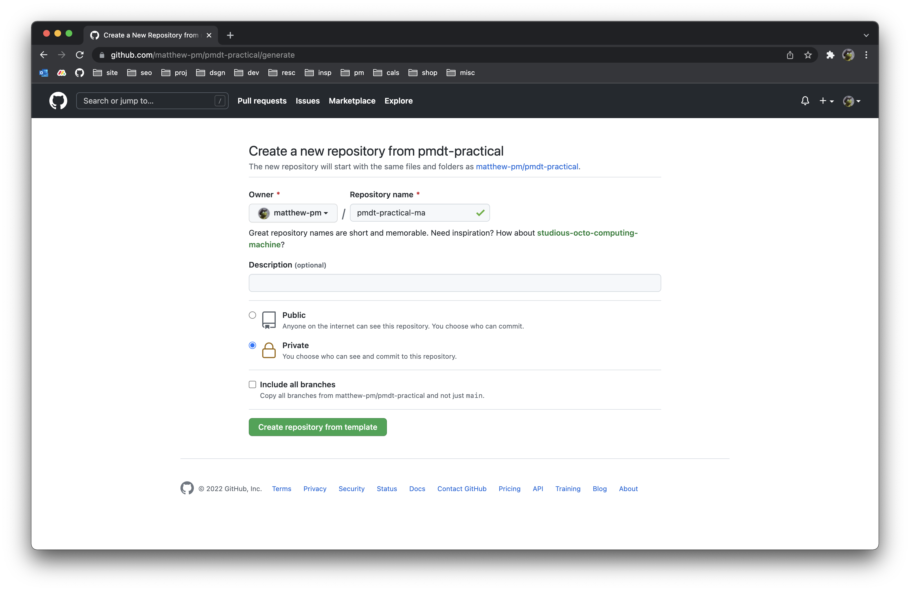
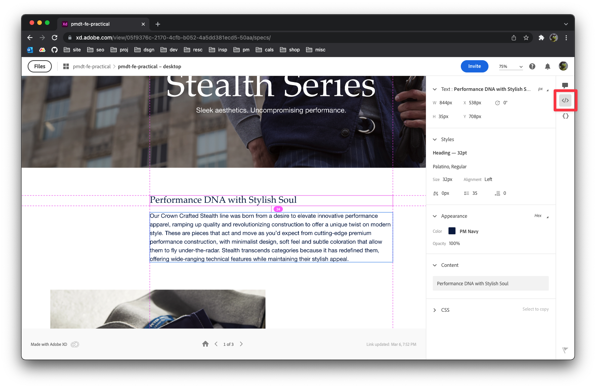
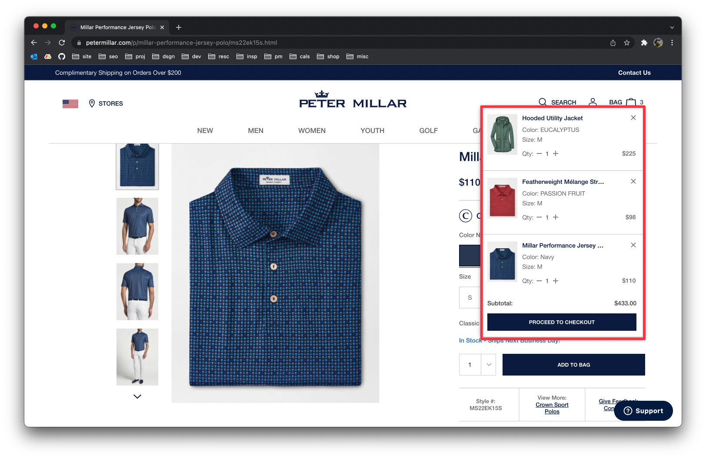
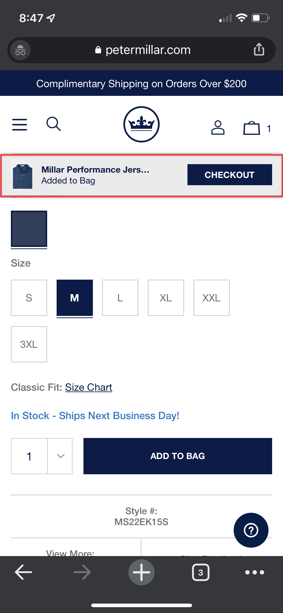

# PM Jr. Design Technologist Practical Brief

## Overview
These practicals are designed to test your skills and technique across both disciplines: front-end web development and UX design. You should complete the practicals according to the specifications within this document.

## Instructions
This repository has been set up as template repo on GitHub, enabling you to easily [create your project repo](https://github.com/matthew-pm/pmdt-practical/generate) from it.

### Setup
1. Create new repo from template
    - Follow the link above, or go to [matthew-pm/pmdt-practical](https://github.com/matthew-pm/pmdt-practical) and click the "Use this template" button
    - Name the repo: `pmdt-practical-<your-initials>`, e.g., `pmdt-practical-ma`
    - Set as Private
2. Once you've created the new repo, add the user [**matthew-pm**](https://github.com/matthew-pm) as a collaborator. This will give me easy access to your project repo. I'll review by cloning your project repo. 
3. Clone the repo to your local machine

**Helpful GitHub docs:**
- [Creating a repository from a template](https://docs.github.com/en/repositories/creating-and-managing-repositories/creating-a-repository-from-a-template#creating-a-repository-from-a-template)
- [Inviting collaborators to a personal repository](https://docs.github.com/en/account-and-profile/setting-up-and-managing-your-github-user-account/managing-access-to-your-personal-repositories/inviting-collaborators-to-a-personal-repository)

## Final Deliverable
Your project repo will serve as the final deliverable that will contain everything to be reviewed. All source code and other files related to the FE Dev practical should be included in `pmdt-fe/`. All design documents and other files related to the UX practical should be included in `pmdt-ux/`.

---

## FE Dev Practical
Project Folder: `pmdt-fe`

Read [`pmdt-fe/README.md`](./pmdt-fe/README.md) for more info on the development environment that has been set up for you. The setup uses Parcel, a zero configuration build tool.

It's highly recommended to use the setup as is, with Parcel (no additional configuration should be required to complete the tasks). You can use as much or as little of the boilerplate as you'd like. **If you want to go fully vanilla without a build tool, that's perfectly fine**. In that case, you should document any differences in the npm scripts used to run and build your project in your `pmdt-fe/README.md`.

The review process will include running `npm run dev` and `npm run build`, inspecting your source code, and inspecting your page in a browser.

#### Code Rules & Requirements
In the review, we'd like to evaluate your skills and technique regarding HTML, CSS, and JS. Frameworks are not allowed, but build tools, common preprocessors, and compilers are allowed.

- Your source code should consist of primarily HTML, CSS (or Sass), and JS (if applicable).
- Frameworks or libraries like React, Svelte, Vue, and Angular are **not allowed**
- Templating languages such as Handlebars and Liquid are **not allowed**.
- CSS frameworks such as Bootstrap and Tailwind are **not allowed**. 
- Tools that _are allowed_:
    - Sass (already configured)
    - PostCSS (Parcel can be configured for this easily)
    - CSS resets or variations of this concept, such as [normalize.css](https://github.com/necolas/normalize.css).
    - Tools that help you modularize HTML (e.g., [PostHTML](https://parceljs.org/languages/html/#posthtml) & `posthtml-include`; already configured)

### Assignment
Your task is to build a web page according to the given design. [View the design via an XD link](https://xd.adobe.com/view/05f9376c-2170-4cfb-b052-4a5dd381ecd5-50aa/grid). Make the rendered page look as close to the design as you can using your knowledge of HTML, CSS, and responsive design.

This practical is also intended to test your ability to analyze a design and extract or infer details that may not be annotated. If there are details you're unsure about, use your best judgement, both as a designer and a developer.

Read the annotations within the XD link's `Comments View` for additional specifications for the implementation. The copy for the design can be pulled from the XD link's `Specs View` or from `pmdt-fe/copy.md`.

Some general things to consider with your code:
- Web development best practices
- "Good code"
- Responsive design

#### XD Links: Specs View
Click the `Specs View` (</> icon) to see information about the design, styles, and easily copy text. In this view, you can navigate around the artboard and inspect specific elements, see their spacing by hovering over adjacent elements, etc. Read more about how to [view and inspect design specs](https://helpx.adobe.com/xd/help/inspect-design-specs.html) in XD links.

### Deliverables
- Your source code for the FE Dev Practical, within `pmdt-fe/`
- If you modify the initial setup to use a different build tool, you must update the npm scripts or document how to run your project

---

## UX Design Practical
Project Folder: `pmdt-ux`
<!-- TODO -->

### Assignment
Your task is to design **Variant B** of the Minicart component for a theoretical A/B test. **Variant A**, the control design, is provided as PNGs within `pmdt-ux/`. Variant A is also the existing implementation on the [Peter Millar website](https://www.petermillar.com/).

Assume the following statements are true:

- Our customers typically only purchase 1–2 items before checking out.
- Customers who add 3+ items to their cart typically never end up checking out.
- Peter Millar is a "Luxury Men's Fashion" brand.
- Peter Millar uses the text "Bag" or "Shopping Bag" when referring to the user's shopping cart on the site.

**You should redesign the Minicart component to support the hypothesis.** Essentially, your design should encourage users to check out at a higher rate. You should design for both desktop and mobile. You have the freedom to define the layout and interaction specifications of the designs (i.e., in your designs, these can differ from the control).

**Following your submission of Variant B, you will be asked to present your design.**

**Note:** the Minicart and the Cart page are two separate entities. The Minicart is a condensed version of the Cart page that currently displays as an overlay. The Cart page is not within the scope of this A/B test.

#### Hypothesis
If the Minicart is more immersive and draws the user's focus to the content within it, the user will be encouraged to proceed to checkout. This will cause an increase in the rate of completed purchases.

#### The Control
On desktop, the Minicart shows when adding a product to the cart, and when a user hovers on the Bag icon (when there is at least one product in their cart).

On mobile, the Minicart only shows temporarily after adding a product to the cart. The design differs from desktop; it's more like a toast notification with a CTA. (Clicking on the Bag icon takes users to the Cart page.)

<!--  -->

  

To reproduce this UI state:
1. Navigate to a product page
2. Select the product options (size, color, etc.) and click the "Add to Bag" button
3. The Minicart will automatically show

#### Other Requirements
You can use Adobe XD or Figma to design Variant B. If you use Figma, create a new file in this repo, `pmdt-ux/design.md`, and include a link to your design file within it.

You should include any ideations or iterations. If you create low-fidelity wireframes or sketches, include those too!

### Deliverables
- Design Document (XD or Figma). It should include:
  - Final comps for Variant B
  - Any non-final versions or iterations you want to share
- Anything that might help you present the final design, such as a prototype or other documents.
